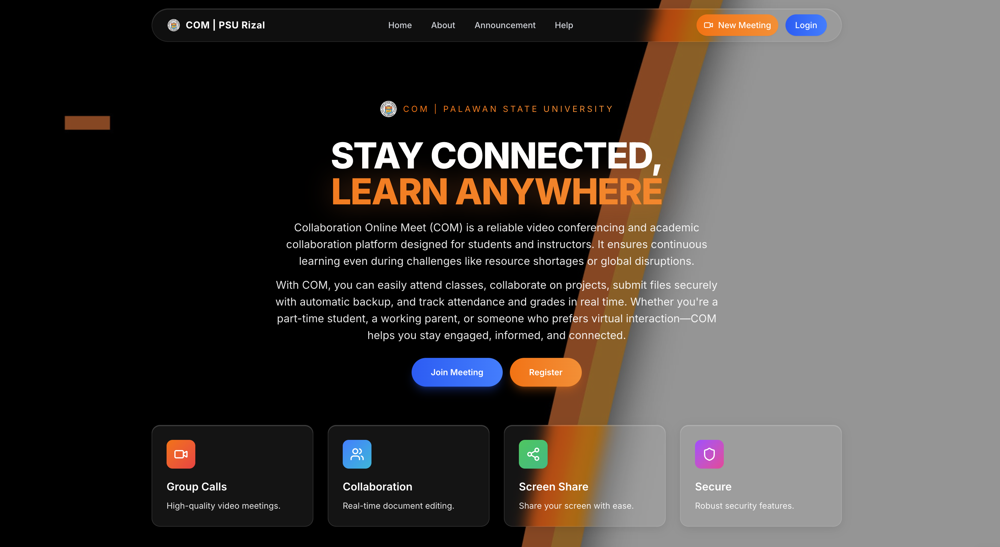

# PSU Rizal - Academic Collaboration Platform



> **Palawan State University - Rizal Campus**  
> A comprehensive online collaboration and meeting platform for academic excellence


---

## 📋 Table of Contents

- [Overview](#-overview)
- [Features](#-features)
- [Tech Stack](#-tech-stack)
- [Project Status](#-project-status)
- [Getting Started](#-getting-started)
- [Project Structure](#-project-structure)
- [Authentication & Roles](#-authentication--roles)
- [Deployment](#-deployment)
- [Documentation](#-documentation)
- [Scripts](#-scripts)
- [Contributing](#-contributing)

---

## 🎯 Overview

PSU Rizal Academic Collaboration Platform is a modern, full-stack web application designed to facilitate online learning, collaboration, and academic management for Palawan State University - Rizal Campus. The platform provides video conferencing, academic management, and role-based access for students, faculty, and administrators.

### Key Highlights

- ✅ **Production Ready** - Fully tested and deployment-ready with autoscale configuration
- 🎥 **Enterprise Video** - Twilio Video integration for HD conferencing (up to 50 participants)
- 👥 **Guest Access** - No account required for joining meetings
- 📚 **Academic Management** - Complete curriculum system with 4 programs and 164 subjects
- 🔐 **Secure Authentication** - JWT-based with role-based access control and admin approval
- 📱 **Responsive Design** - Beautiful glass morphism UI that works on all devices
- 🚀 **Modern Stack** - Next.js 14, React 18, TypeScript, Tailwind CSS 4, PostgreSQL
- 🔄 **Multi-Platform** - Deploys to Replit (autoscale), Vercel, or Firebase

---

## ✨ Features

### For Students

- 📖 View enrolled courses and progress
- 📝 Submit assignments and track grades
- 📅 Access class schedules
- 📥 Download course materials and resources
- 🔔 Receive notifications and announcements
- 🎥 Join video classes instantly

### For Faculty

- 👨‍🏫 Manage multiple classes and sections
- 📊 Track student attendance and performance
- ✍️ Grade assignments and provide feedback
- 📢 Post announcements to students
- 📤 Upload teaching materials
- 🎥 Conduct live video lectures

### For Administrators

- 🎛️ Content management system (CMS)
- 💰 Pricing and subscription management
- 📈 Analytics and reporting
- ⚙️ Platform settings and configuration

### Video Conferencing (Twilio Video)

- 🎥 **Enterprise-grade HD video** - Powered by Twilio Video SDK
- 🎤 **Professional controls** - Mute/unmute, camera on/off
- 🖥️ **Screen sharing** - Built-in screen share capability
- 💬 **Real-time chat** - In-meeting chat with WebSocket
- 👥 **Up to 50 participants** - Scalable SFU architecture
- 🔗 **Guest access** - Join meetings without account via shareable links
- 📹 **Recording ready** - Infrastructure for meeting recordings
- 🌐 **Global reliability** - Twilio's enterprise infrastructure

---

## 🛠 Tech Stack

### Frontend

- **Framework:** Next.js 14.2.4 (App Router)
- **UI Library:** React 18.2.0
- **Language:** TypeScript
- **Styling:** Tailwind CSS 4.1.9
- **Components:** Radix UI primitives
- **Icons:** Lucide React
- **Charts:** Chart.js, Recharts
- **Forms:** React Hook Form + Zod validation

### Backend & Database

- **Database ORM:** Drizzle ORM
- **Database:** PostgreSQL (Replit/Neon)
- **Database Driver:** postgres driver
- **Authentication:** JWT with jose library
- **Password Hashing:** bcryptjs
- **API Routes:** Next.js serverless functions
- **Middleware:** Role-based access control

### Real-time & Video

- **Video Platform:** Twilio Video (Enterprise SFU)
- **Video SDK:** twilio-video 2.x
- **Real-time Chat:** WebSocket
- **State Management:** React Hooks + TanStack Query
- **Storage:** Replit Object Storage (multi-platform adapter)

### Deployment & DevOps

- **Primary Hosting:** Replit (autoscale deployment)
- **Alternative Hosting:** Vercel, Firebase
- **Environment:** Node.js 20+
- **Package Manager:** pnpm
- **Build Tool:** Next.js compiler
- **CI/CD:** Automated deployments configured
- **Feature Flags:** Runtime toggles with @vercel/flags

---

## 📊 Project Status

### ✅ Completed Features

| Feature              | Status      | Description                                                               |
| -------------------- | ----------- | ------------------------------------------------------------------------- |
| Authentication       | ✅ Complete | JWT-based with admin approval workflow                                    |
| Student Dashboard    | ✅ Complete | 6 tabs (Courses, Assignments, Grades, Schedule, Resources, Notifications) |
| Faculty Dashboard    | ✅ Complete | 6 tabs (Classes, Students, Grading, Schedule, Resources, Announcements)   |
| Admin Dashboard      | ✅ Complete | CMS with content, pricing, analytics, settings                            |
| Guest Access         | ✅ Complete | Join meetings without account                                             |
| Twilio Video         | ✅ Complete | Enterprise HD video with up to 50 participants                            |
| Meeting UI           | ✅ Complete | Professional conference layout with controls                              |
| Curriculum System    | ✅ Complete | 4 bachelor programs, 164 subjects, complete curriculum                    |
| Database Schema      | ✅ Complete | 20+ tables with relationships                                             |
| Documentation        | ✅ Complete | Comprehensive docs in /docs folder                                        |
| Deployment Config    | ✅ Complete | Replit autoscale + Vercel + Firebase ready                                |
| Multi-Platform Ready | ✅ Complete | Auto-detects and configures for deployment platform                       |

### 🔄 In Progress / Future Enhancements

| Feature              | Status     | Notes                                           |
| -------------------- | ---------- | ----------------------------------------------- |
| Email Notifications  | 🟡 Pending | Infrastructure ready, needs SMTP configuration  |
| Advanced Analytics   | 🟡 Pending | Basic analytics implemented                     |
| File Upload to Cloud | 🟡 Pending | Object storage ready, UI needs implementation   |
| Mobile App           | 🟡 Future  | PWA support ready                               |
| Sentry Integration   | 🟡 Optional| Error monitoring configured but needs DSN       |

---

## 🚀 Getting Started

### Prerequisites

- **Node.js** 18.0.0 or higher
- **pnpm** 8.0.0 or higher
- **Git** for version control
- **Supabase** account (for database and auth)

### Installation

1. **Clone the repository**

   ```bash
   git clone https://github.com/PROJECT01GALAHADD/COM-PSU-Rizal.git
   cd COM-PSU-Rizal
   ```

2. **Install dependencies**

   ```bash
   pnpm install
   ```

3. **Set up environment variables**

   ```bash
   cp .env.example .env.local
   ```

   Edit `.env.local` with your configuration:

   ```env
   # Database (Required)
   DATABASE_URL=your_postgres_connection_string

   # Authentication (Required)
   JWT_SECRET=your_jwt_secret
   SESSION_SECRET=your_session_secret

   # Twilio Video (Required for video conferencing)
   TWILIO_ACCOUNT_SID=your_twilio_account_sid
   TWILIO_API_KEY=your_twilio_api_key
   TWILIO_API_SECRET=your_twilio_api_secret

   # Optional: Error monitoring
   NEXT_PUBLIC_SENTRY_DSN=your_sentry_dsn
   ```

4. **Run database migrations**

   ```bash
   pnpm db:push
   ```

5. **Start the development server**

   ```bash
   pnpm dev
   ```

6. **Open your browser**
   ```
   http://localhost:3000
   ```

### Quick Start with Scripts

We provide convenient scripts in the `/scripts` folder:

```bash
# Start app with database
bash scripts/deployment/start-app.sh --with-db

# Upload to GitHub
bash scripts/deployment/quick-upload.sh

# Deploy to Vercel
bash scripts/deployment/prepare-for-vercel.sh
```

---

## 📁 Project Structure

```
PSU-Rizal/
├── app/                          # Next.js App Router
│   ├── api/                      # API routes
│   │   ├── auth/                 # Authentication endpoints
│   │   ├── debug/                # Debug utilities
│   │   └── geo/                  # Geolocation API
│   ├── admin/                    # Admin dashboard
│   ├── faculty/                  # Faculty dashboard
│   ├── student/                  # Student dashboard
│   ├── meetings/                 # Video conferencing
│   ├── guest/                    # Guest access
│   └── [pages]/                  # Other pages
├── components/                   # React components
│   ├── ui/                       # Radix UI components
│   ├── auth/                     # Auth components
│   ├── dashboard/                # Dashboard components
│   └── [others]/                 # Shared components
├── lib/                          # Core libraries
│   ├── database/                 # Drizzle ORM setup
│   │   ├── schema.ts             # Database schema
│   │   ├── connection.ts         # DB connection
│   │   └── utils.ts              # DB utilities
│   ├── supabase/                 # Supabase clients
│   └── auth.ts                   # JWT utilities
├── hooks/                        # React hooks
│   ├── use-webrtc.ts             # WebRTC hook
│   ├── use-websocket.ts          # WebSocket hook
│   └── use-toast.ts              # Toast notifications
├── docs/                         # Documentation
│   ├── deployment/               # Deployment guides
│   ├── setup/                    # Setup instructions
│   ├── archive/                  # Historical docs
│   └── [guides]/                 # Various guides
├── scripts/                      # Utility scripts
│   ├── deployment/               # Deployment scripts
│   ├── database/                 # Database scripts
│   └── utilities/                # Helper scripts
├── public/                       # Static assets
│   ├── images/                   # Images
│   └── icons/                    # Icons
├── drizzle/                      # Drizzle migrations
├── supabase/                     # Supabase config
└── [config files]                # Configuration files
```

---

## 🔐 Authentication & Roles

### Authentication Flow

1. **Login/Signup** → API validates credentials
2. **JWT Generation** → Server signs JWT with user data
3. **Cookie Storage** → httpOnly cookie set
4. **Middleware Verification** → Every request verified
5. **Role-Based Routing** → Access granted based on role

### User Roles

| Role        | Access                                   | Routes                   |
| ----------- | ---------------------------------------- | ------------------------ |
| **Student** | Student dashboard, courses, assignments  | `/student/*`             |
| **Faculty** | Faculty dashboard, classes, grading      | `/faculty/*`             |
| **Admin**   | Full platform control, CMS, analytics    | `/admin/*`               |
| **Guest**   | Meeting access only (with URL parameter) | `/meetings/*?guest=true` |

### Demo Credentials

For testing purposes:

```
Student:
  Email: student@psu.edu.ph
  Password: student123

Faculty:
  Email: faculty@psu.edu.ph
  Password: faculty123

Admin:
  Email: admin@psu.edu.ph
  Password: admin123
```

---

## 🌐 Deployment

### Deploy to Vercel

[](https://vercel.com/new/clone?repository-url=https://github.com/PROJECT01GALAHADD/COM-PSU-Rizal)

**Manual Deployment:**

1. Push code to GitHub
2. Connect repository to Vercel
3. Add environment variables
4. Deploy

**Detailed Guide:** See [`docs/deployment/guide.md`](docs/deployment/guide.md)

### Deploy to Replit (Recommended)

This platform is optimized for Replit with **autoscale deployment** configuration.

**Quick Steps:**
1. Import from GitHub: `https://github.com/PROJECT01GALAHADD/COM-PSU-Rizal`
2. Set required secrets in Replit Secrets:
   - `DATABASE_URL` - Your production PostgreSQL database
   - `JWT_SECRET` - Strong secret (32+ characters)
   - `SESSION_SECRET` - Strong secret for sessions
3. Connect **Twilio integration** via Replit Connectors (automatic credential management)
4. Click **Deploy** button - Build takes ~2-3 minutes
5. Your app goes live at your Replit deployment URL!

**Deployment Configuration:**
- ✅ Build command: `pnpm run build` (already configured)
- ✅ Start command: `next start -H 0.0.0.0 -p ${PORT:-5000}`
- ✅ Deployment target: `autoscale` (auto-scales based on traffic)
- ✅ Port binding: Automatically uses Replit's PORT environment variable

**Testing Video:**
After deployment, test video conferencing at `/meeting/test-001`

**Detailed Guides:**
- [`docs/deployment-success.md`](docs/deployment-success.md) - Complete deployment guide
- [`docs/twilio-quick-start.md`](docs/twilio-quick-start.md) - Twilio Video setup
- [`docs/twilio-migration.md`](docs/twilio-migration.md) - Full Twilio documentation

### Environment Variables (Production)

Required for deployment:

```env
# Database (Required)
DATABASE_URL=your_postgresql_connection_string

# Authentication (Required)
JWT_SECRET=your_strong_secret_32_chars_minimum
SESSION_SECRET=your_session_secret

# Twilio Video (Required - or use Replit connector)
TWILIO_ACCOUNT_SID=your_account_sid
TWILIO_API_KEY=your_api_key
TWILIO_API_SECRET=your_api_secret

# Optional: Error Monitoring
NEXT_PUBLIC_SENTRY_DSN=your_sentry_dsn
SENTRY_AUTH_TOKEN=your_sentry_token
```

**Note:** When deploying to Replit, use the Twilio connector for automatic credential management.

---

## 📚 Documentation

Comprehensive documentation is available in the `/docs` folder:

### Quick Links

- 🚀 [Start Here](docs/start-here.md) - Complete getting started guide
- 📖 [Documentation Index](docs/README.md) - Full documentation catalog
- 🎥 [Twilio Video Quick Start](docs/twilio-quick-start.md) - Test video conferencing
- 🔧 [Twilio Migration Guide](docs/twilio-migration.md) - Full Twilio documentation
- 🌐 [Deployment Guide](docs/deployment-success.md) - Deploy to production
- 🗄️ [Database Setup](docs/database.md) - Database configuration
- 📋 [Project Summary](docs/project-summary.md) - Detailed project overview
- 🏃 [Running the App](docs/running-the-application.md) - Local development
- 📜 [Multi-Platform Deployment](docs/multi-platform-deployment.md) - Deploy anywhere
- 🔄 [Platform Upgrade Plan](docs/platform-upgrade-plan.md) - Enhancement roadmap

### Documentation Structure

```
docs/
├── README.md                     # Documentation index
├── deployment/                   # Deployment guides
│   ├── start-here.md
│   ├── guide.md
│   ├── github-upload.md
│   └── checklist.md
├── setup/                        # Setup & configuration
│   ├── quick-reference.md
│   ├── database-manual.md
│   └── supabase-guide.md
└── [other docs]                  # Various guides
```

---

## 🔧 Scripts

All scripts are organized in the `/scripts` folder:

### Deployment Scripts

```bash
# Quick upload to GitHub
bash scripts/deployment/quick-upload.sh

# Start application
bash scripts/deployment/start-app.sh

# Prepare for Vercel
bash scripts/deployment/prepare-for-vercel.sh

# Cleanup for deployment
bash scripts/deployment/cleanup-for-vercel.sh
```

### Database Scripts

```bash
# Initialize database
bash scripts/database/init-db.sh

# Run migrations
pnpm db:push

# Seed database
bash scripts/database/seed-db.sh
```

### Development Scripts

```bash
# Start development server
pnpm dev

# Build for production
pnpm build

# Run tests
pnpm test

# Type check
pnpm type-check

# Lint code
pnpm lint
```

---

## 📦 Database Schema

### Core Tables

- **users** - User accounts with roles (student, faculty, admin, guest)
- **meetings** - Video conference meetings
- **participants** - Meeting participants
- **chat_messages** - In-meeting chat
- **courses** - Academic courses
- **enrollments** - Student-course relationships
- **assignments** - Course assignments
- **submissions** - Student assignment submissions

### Relationships

```
users
├── → meetings (as host)
├── → enrollments (as student)
├── → submissions (as student)
└── → courses (as faculty)

meetings
├── → participants
├── → chat_messages
└── → courses

courses
├── → enrollments
└── → assignments
    └── → submissions
```

**Full Schema:** See [`lib/database/schema.ts`](lib/database/schema.ts)

---

## 🤝 Contributing

We welcome contributions! Here's how you can help:

1. **Fork the repository**
2. **Create a feature branch** (`git checkout -b feature/amazing-feature`)
3. **Commit your changes** (`git commit -m 'Add amazing feature'`)
4. **Push to branch** (`git push origin feature/amazing-feature`)
5. **Open a Pull Request**

### Development Guidelines

- Follow TypeScript best practices
- Use Tailwind CSS for styling
- Follow the existing code structure
- Add tests for new features
- Update documentation as needed
- **Read**: [`docs/documentation-rules.md`](docs/documentation-rules.md) for documentation standards

---

## 📄 License

This project is developed for **Palawan State University - Rizal Campus**.  
Educational use only.

---

## 🙏 Acknowledgments

- **Palawan State University** - For the opportunity to build this platform
- **Next.js Team** - For the amazing framework
- **Vercel** - For hosting and deployment platform
- **Supabase** - For backend infrastructure
- **Radix UI** - For accessible UI components
- **Tailwind CSS** - For the styling framework

---

## 📞 Support

For questions or issues:

- 📧 Email: support@psu.edu.ph
- 📚 Documentation: [`/docs`](docs/README.md)
- 🐛 Issues: [GitHub Issues](https://github.com/PROJECT01GALAHADD/COM-PSU-Rizal/issues)

---

## 🗺️ Roadmap

### Version 1.0 (Current - Production Ready) ✅

- [x] JWT authentication with admin approval workflow
- [x] Student/Faculty/Admin dashboards (complete)
- [x] **Twilio Video integration** - Enterprise HD video conferencing
- [x] Guest access for meetings
- [x] Complete curriculum system (4 programs, 164 subjects)
- [x] Database schema with 20+ tables
- [x] Deployment configuration (Replit autoscale, Vercel, Firebase)
- [x] Multi-platform storage adapter
- [x] Feature flags system
- [x] Real-time chat via WebSocket

### Version 1.1 (Optional Enhancements) 🔄

- [ ] Sentry error monitoring (configured, needs DSN)
- [ ] Email notifications (infrastructure ready)
- [ ] File upload UI (storage adapter ready)
- [ ] Advanced analytics dashboard
- [ ] Meeting recordings (Twilio supports this)
- [ ] Mobile PWA optimizations

### Version 2.0 (Future Vision) 🚀

- [ ] Native mobile applications (iOS/Android)
- [ ] AI-powered features (assignment grading, attendance tracking)
- [ ] Advanced reporting and data visualization
- [ ] Integration with university enrollment systems
- [ ] Multi-campus support
- [ ] Learning Management System (LMS) features

---

<div align="center">

**Made with ❤️ for PSU Rizal**

[🌐 Live Demo](https://com-psu-rizal.vercel.app) | [📖 Documentation](docs/README.md) | [🐛 Report Bug](https://github.com/PROJECT01GALAHADD/COM-PSU-Rizal/issues)

</div>
# COM-PSU-Rizal
