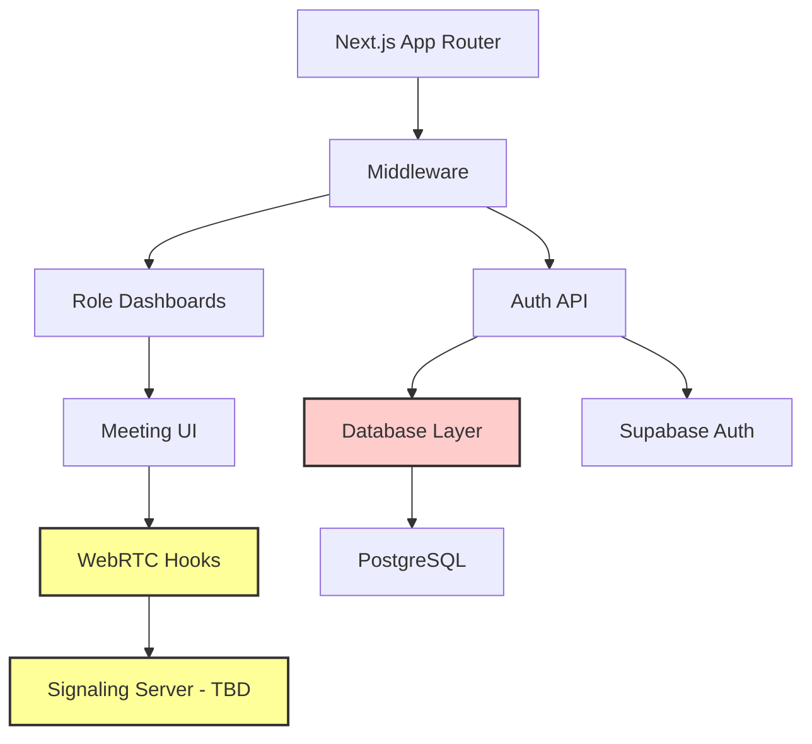

# AGENTS.md
This file provides guidance to Verdent when working with code in this repository.

## Table of Contents
1. Commonly Used Commands
2. High-Level Architecture & Structure
3. Key Rules & Constraints
4. Development Hints

## Commands

**Development:**
```bash
pnpm dev                    # Start Next.js dev server on http://localhost:3000
pnpm build                  # Production build
pnpm start                  # Start production server
pnpm lint                   # Run ESLint (currently ignored during builds)
```

**Testing:**
```bash
pnpm test                   # Run Vitest in watch mode
pnpm test:run               # Run tests once
pnpm test:ui                # Open Vitest UI
```

**Database:**
```bash
pnpm db:up                  # Start local Postgres via Docker
pnpm db:down                # Stop local Postgres
pnpm db:logs                # View database logs
pnpm db:seed                # Seed local database
pnpm init-db                # Generate and push Drizzle migrations
```

**Supabase:**
```bash
pnpm supabase:start         # Start local Supabase stack
pnpm supabase:stop          # Stop Supabase
pnpm supabase:seed          # Seed Supabase database
```

## Architecture

### Overview
PSU Rizal Collaboration Platform is a Next.js 14 (App Router) web application for academic video conferencing and collaboration, targeting Palawan State University students, faculty, and administrators. The goal is Google Meet-like functionality with role-based dashboards.

### Major Subsystems

1. **Authentication & Authorization**
   - JWT-based auth with role-based access control (admin, faculty, student, guest)
   - Middleware enforces route protection based on user roles
   - Located in: `/lib/auth.ts`, `/middleware.ts`, `/app/api/auth/`

2. **Video Conferencing (In Development)**
   - WebRTC for peer-to-peer video/audio
   - WebSocket signaling for connection setup
   - Located in: `/hooks/use-webrtc.ts`, `/hooks/use-websocket.ts`, `/components/video-conference-layout.tsx`
   - **Note:** Currently UI prototype only; actual WebRTC/signaling not implemented

3. **Role-Based Dashboards**
   - Admin: User management, platform analytics, system settings (`/app/admin/`)
   - Faculty: Meeting scheduling, course management (`/app/faculty/` - login only currently)
   - Student: Join meetings, view courses (`/app/student/` - login only currently)
   - Components in: `/components/dashboard/admin/`, `/components/dashboard/student-faculty/`

4. **Database Layer**
   - Drizzle ORM with PostgreSQL
   - Schema defined in: `/lib/database/schema.ts` (runtime) and `/lib/db/schema/index.ts` (migrations)
   - Connection modules: `/lib/database/connection.ts`, `/lib/db/connection.ts`
   - **Known issue:** Schema/connection duplication causes integration problems

5. **Meeting Management**
   - Meeting CRUD, participants, chat messages
   - Database schema ready but API routes not implemented
   - Schema in: `/lib/database/schema.ts` (meetings, participants, chatMessages tables)

### Key Data Flows

**Authentication Flow:**
```
User submits credentials → /api/auth/login
  ↓
Supabase Auth validates → Local DB lookup for role
  ↓
JWT signed (jose) → httpOnly cookie 'auth-token' set
  ↓
Middleware verifies token → Attaches x-user-type header
  ↓
Page/API checks role → Renders role-specific content
```

**Meeting Join Flow (Planned):**
```
User clicks join → Pre-join screen (device test)
  ↓
POST /api/meetings/join → Participant record created
  ↓
WebSocket connects → Signaling server
  ↓
RTCPeerConnection established → ICE/STUN/TURN
  ↓
Media streams exchanged → Video/audio rendered
```

### External Dependencies

- **Supabase:** PostgreSQL database, optional auth provider
- **Shadcn/UI + Radix:** Component library
- **Drizzle ORM:** Type-safe database queries
- **Jose:** JWT signing/verification (Edge runtime compatible)
- **WebRTC:** Browser APIs for video/audio (navigator.mediaDevices)
- **TURN Server:** Required for production video calls (not configured yet)

### Development Entry Points

- **Landing page:** `/app/page.tsx` (marketing site, needs conversion to academic focus)
- **Login:** `/app/login/page.tsx` (uses `/api/auth/login`)
- **Signup:** `/app/signup/page.tsx` (uses `/api/auth/signup`)
- **Admin dashboard:** `/app/admin/page.tsx` (full-featured but client-side auth only)
- **Meeting room:** `/app/meetings/[id]/page.tsx` (UI prototype)
- **Meeting creation:** `/app/meetings/create/page.tsx` (generates mock IDs)

### Subsystem Relationships



**Legend:**
- Yellow fill: Not yet implemented or incomplete
- Red fill: Has integration issues

## Key Rules & Constraints

### From Technical Documentation

1. **Authentication:**
   - **CRITICAL:** Middleware publicRoutes includes `'/'` which bypasses all protection (middleware.ts:6-7). This must be fixed.
   - All login flows MUST set `auth-token` httpOnly cookie with JWT containing `{ userId, email, userType }`
   - Use `jose` library for JWT (Edge runtime compatible), not `jsonwebtoken`
   - Admin dashboard currently uses separate `admin-session` cookie - MUST migrate to unified JWT

2. **Database:**
   - **CRITICAL:** Two conflicting schemas exist. Runtime uses `/lib/database/schema.ts`, but Drizzle Kit points to `/lib/db/schema/index.ts`
   - Connection strings must NOT use empty fallback `postgres("")` - causes runtime errors
   - Use single connection module with SSL support: `/lib/db/connection.ts`
   - User role field: standardize on `userType` text enum, not mixed `role`/`userType`

3. **Video Conferencing:**
   - WebRTC hooks currently contain placeholder code only
   - `localStream` must be bound to video element via `ref.srcObject`
   - RTCPeerConnection lifecycle: create → add tracks → offer/answer SDP → ICE candidates → ontrack
   - TURN server is mandatory for production (NAT traversal)
   - WebSocket hook currently simulates connection with setTimeout - replace with real socket.io client

4. **Templates:**
   - `/templates/*` are v0-generated standalone apps, NOT part of main codebase
   - Do NOT modify files in `/templates/` directly
   - Components have been copied to main app under `/components/` and `/app/`
   - Templates are excluded from linting, type checking, and searches

5. **TypeScript:**
   - Build errors currently ignored (`ignoreBuildErrors: true` in next.config.mjs)
   - Known issues: AuthForm prop mismatches, admin dashboard type errors, unused variables
   - Do NOT add new ignored errors - fix at source

6. **Security:**
   - Remove all fallback secrets (`fallback_secret_key` in lib/auth.ts, middleware.ts)
   - Require `JWT_SECRET` or `SUPABASE_JWT_SECRET` environment variable
   - Auth cookies: `httpOnly: true`, `secure: true` (production), `sameSite: 'lax'`
   - Never expose `SUPABASE_SERVICE_ROLE_KEY` to client
   - Validate all API inputs with Zod schemas

### Project-Specific Constraints

1. **Target audience:** PSU College students, faculty, administrators in Philippines
2. **Primary use case:** Online classes, academic meetings, student collaboration
3. **Deployment:** Vercel (current), can be self-hosted for data sovereignty
4. **Browser support:** Latest 2 versions of Chrome, Edge, Firefox, Safari (desktop + mobile)
5. **Max participants per meeting:** 50 (configurable, future SFU architecture for scale)
6. **Data residency:** Prefer local/Supabase for academic data privacy compliance

### From README.md

1. The project is part of a formal academic thesis (documented in `/docs/thesis.md` and `PALAWAN-STATE-UNIVERSITY-COLLABORATION-ONLINE-MEET-thesis.docx`)
2. Treat thesis document as authoritative reference for objectives and requirements
3. Platform must support both cloud (Vercel) and local deployment (Docker Postgres)
4. Guest access is a first-class feature (no signup required to join meetings)

## Development Hints

### Adding a New API Endpoint

1. Create route handler in `/app/api/[resource]/route.ts`
2. Import database connection: `import { db } from '@/lib/database/connection'`
3. Import schema: `import { schema } from '@/lib/database/schema'`
4. Validate request body with Zod schema
5. Check authentication from headers: `request.headers.get('x-user-type')`
6. Return `NextResponse.json()` with proper status codes

**Example:**
```typescript
// app/api/meetings/route.ts
import { NextRequest, NextResponse } from 'next/server'
import { db } from '@/lib/database/connection'
import { schema } from '@/lib/database/schema'
import { z } from 'zod'

const createMeetingSchema = z.object({
  title: z.string().min(1).max(100),
  scheduledStart: z.string().datetime().optional(),
})

export async function POST(request: NextRequest) {
  const userType = request.headers.get('x-user-type')
  if (!userType || !['faculty', 'admin'].includes(userType)) {
    return NextResponse.json({ error: 'Forbidden' }, { status: 403 })
  }

  const body = await request.json()
  const parsed = createMeetingSchema.safeParse(body)
  
  if (!parsed.success) {
    return NextResponse.json({ error: parsed.error }, { status: 400 })
  }

  const userId = request.headers.get('x-user-id')
  const meeting = await db.insert(schema.meetings).values({
    title: parsed.data.title,
    hostId: userId,
    // ... other fields
  }).returning()

  return NextResponse.json({ meeting }, { status: 201 })
}
```

### Modifying CI/CD Pipeline

This project uses Vercel auto-deployment:
1. Push to `main` branch triggers production deploy
2. PRs trigger preview deployments
3. Environment variables managed in Vercel dashboard
4. No custom GitHub Actions currently configured

To add custom CI:
1. Create `.github/workflows/ci.yml`
2. Run `pnpm lint`, `pnpm test:run`, `pnpm build`
3. Ensure DATABASE_URL uses test database or mock

### Extending Dashboard Subsystems

**Adding a new admin feature:**
1. Add component in `/components/dashboard/admin/[feature-name]/`
2. Import into `/app/admin/page.tsx` (large monolithic component)
3. Add to `sidebarItems` state array (line ~541)
4. Add tab/section in main content area
5. Consider refactoring to dedicated route `/app/admin/[feature]/page.tsx` for maintainability

**Adding student/faculty dashboard:**
1. Create `/app/student/page.tsx` or `/app/faculty/page.tsx`
2. Import layout from `/components/dashboard/student-faculty/`
3. Add server-side role check or use middleware protection
4. Fetch user-specific data using x-user-id header from middleware

**Shared dashboard components:**
- Sidebar: `/components/dashboard/student-faculty/sidebar.tsx`
- Mobile nav: `/components/dashboard/student-faculty/mobile-nav.tsx`
- Alerts: `/components/dashboard/student-faculty/alerts-section.tsx`

### Working with WebRTC

**Current state (incomplete):**
- Hooks exist but are placeholders: `/hooks/use-webrtc.ts`, `/hooks/use-websocket.ts`
- Video layout component: `/components/video-conference-layout.tsx`

**To implement real video:**

1. **Setup ICE configuration:**
```typescript
const iceServers = [
  { urls: 'stun:stun.l.google.com:19302' },
  {
    urls: process.env.NEXT_PUBLIC_TURN_URL,
    username: process.env.NEXT_PUBLIC_TURN_USERNAME,
    credential: process.env.NEXT_PUBLIC_TURN_CREDENTIAL,
  }
]
```

2. **Create peer connection:**
```typescript
const pc = new RTCPeerConnection({ iceServers })

// Add local tracks
localStream.getTracks().forEach(track => {
  pc.addTrack(track, localStream)
})

// Handle ICE candidates
pc.onicecandidate = (event) => {
  if (event.candidate) {
    socket.emit('ice-candidate', {
      candidate: event.candidate,
      to: participantId,
    })
  }
}

// Handle remote tracks
pc.ontrack = (event) => {
  setRemoteStreams(prev => ({
    ...prev,
    [participantId]: event.streams[0]
  }))
}
```

3. **Create signaling API:**
- Use Next.js API route with WebSocket or socket.io server
- Exchange SDP offers/answers and ICE candidates
- Track participant presence and state (muted, video on/off)

4. **Bind streams to video elements:**
```typescript
const videoRef = useRef<HTMLVideoElement>(null)

useEffect(() => {
  if (videoRef.current && localStream) {
    videoRef.current.srcObject = localStream
  }
}, [localStream])
```

### Database Migration Workflow

**Current state:** Migrations may not reflect actual schema due to config mismatch.

**Correct workflow:**
1. Ensure `drizzle.config.ts` points to correct schema: `"./lib/database/schema.ts"`
2. Modify schema file: `/lib/database/schema.ts`
3. Generate migration: `pnpm drizzle-kit generate`
4. Review generated SQL in `/drizzle/`
5. Apply migration: `pnpm drizzle-kit push` OR manually via SQL
6. Update TypeScript types match schema

**For fresh start:**
```bash
# Backup database first
pg_dump $DATABASE_URL > backup.sql

# Drop all tables
psql $DATABASE_URL -c "DROP SCHEMA public CASCADE; CREATE SCHEMA public;"

# Regenerate from schema
pnpm init-db
```

### Common Pitfalls

1. **Middleware blocking public routes:**
   - Check `publicRoutes` array in `middleware.ts`
   - Matcher excludes `/api` but middleware code has API logic (dead code)
   - `'/'` in publicRoutes makes ALL paths public (critical bug)

2. **Database connection errors:**
   - Check DATABASE_URL is set and reachable
   - Supabase requires `?sslmode=require` query param
   - Local Docker Postgres: ensure `pnpm db:up` ran successfully

3. **JWT verification fails:**
   - Ensure secret matches between signing (login API) and verification (middleware)
   - Check cookie name is exactly `auth-token`
   - Verify cookie is httpOnly (not accessible via JS)

4. **Video not showing:**
   - Check browser permissions for camera/microphone
   - Verify `localStream` is set in state
   - Ensure video element ref.srcObject is bound
   - Check `autoPlay`, `playsInline`, `muted` (for local stream) attributes

5. **Build fails on Vercel:**
   - TypeScript errors currently ignored (bad practice)
   - Database connection attempts during build (set `output: 'standalone'` if needed)
   - Missing environment variables (check Vercel dashboard)

### Environment Variables Reference

**Required:**
- `DATABASE_URL` - PostgreSQL connection string
- `JWT_SECRET` - Strong random secret for JWT signing (min 32 chars)

**Optional (Supabase):**
- `NEXT_PUBLIC_SUPABASE_URL` - Supabase project URL
- `NEXT_PUBLIC_SUPABASE_ANON_KEY` - Public anon key
- `SUPABASE_SERVICE_ROLE_KEY` - Server-side admin key (never expose to client)
- `SUPABASE_JWT_SECRET` - Alternative JWT secret (use if integrating Supabase auth)
- `SUPABASE_SSL_CERT_PATH` - Path to SSL cert (for local Supabase, usually `./prod-ca-2021.crt`)

**Future (WebRTC):**
- `NEXT_PUBLIC_TURN_URL` - TURN server URL
- `NEXT_PUBLIC_TURN_USERNAME` - TURN credentials
- `NEXT_PUBLIC_TURN_CREDENTIAL` - TURN credentials

**Not recommended:**
- `NOCODB_DATABASE_URL` - Remove (NocoDB is a UI, not a DB protocol)

### Testing Strategy

**Current setup:** Vitest with React Testing Library

**To run specific test:**
```bash
pnpm test -- __tests__/example.test.ts
```

**To add new test:**
1. Create file: `__tests__/[feature].test.ts` or `[component].test.tsx`
2. Import test utilities: `import { render, screen } from '@testing-library/react'`
3. Write tests using `describe`, `it`, `expect`
4. For components, render and query DOM
5. For API routes, mock request/response

**Example component test:**
```typescript
import { render, screen } from '@testing-library/react'
import { Button } from '@/components/ui/button'

describe('Button', () => {
  it('renders children', () => {
    render(<Button>Click me</Button>)
    expect(screen.getByText('Click me')).toBeInTheDocument()
  })
})
```

---

## Quick Reference

**Most critical files:**
- `middleware.ts` - Auth enforcement (FIX REQUIRED)
- `lib/auth.ts` - JWT utilities
- `lib/database/schema.ts` - Database schema (runtime)
- `lib/db/schema/index.ts` - Database schema (migrations - conflict!)
- `app/api/auth/login/route.ts` - Login endpoint
- `drizzle.config.ts` - Database config (MISCONFIGURED)

**Files to avoid editing:**
- `/templates/*` - Standalone v0 apps, not used by main app
- `/database/nocodb/*` - Third-party repo, not part of app
- `/database/supabase/*` - Third-party repo, not part of app
- `/docs/*` - Documentation only, read but don't auto-edit

**Next steps (priority order):**
1. Fix middleware publicRoutes bug
2. Consolidate database schema and connections
3. Unify authentication flows (remove admin-session cookie)
4. Implement real WebRTC and signaling
5. Build student/faculty dashboards
6. Convert landing page to academic focus
